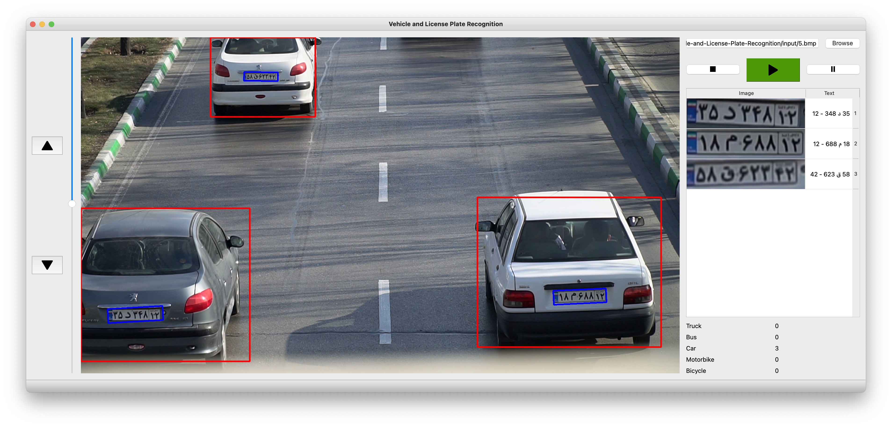

# Vehicle and License Plate Recognition
This software implements the Deep Learning based Vehicle and Persian License Plate Detection and OCR in opencv using Python and C++.

## Reference
- [YOLOv3 multi-type vehicles Detecting](https://github.com/wsh122333/Multi-type_vehicles_flow_statistics)
- [SORT algorithm for tracking](https://github.com/abewley/sort)
- [EAST text detector fot plate detection](https://github.com/argman/EAST)
- [Convolutional Recurrent Neural Network](https://github.com/meijieru/crnn.pytorch)



# Usage

## Python
### Install
Python >= 3.6.0 required with all requirements.txt dependencies installed:
```
cd python
pip install -r requirements.txt
```
Build lanms
```
cd source/lanms
make
```
Back to the root of project and download pretrained models from [GoogleDrive](https://drive.google.com/drive/folders/1fGap3iOAfSTJ8aDaci2DmNHb1KezPxMd?usp=sharing) and put them to models directory.

### Inference
Run following command for process image in command line interface mode:
```
python3 python/inference_image.py -i IO/input/1.bmp
```

Run following command for process image in graphical user interface mode:
```
python3 python/inference_gui.py
```
Run following command for process video in command line mode:
```
python3 python/inference_cli.py
```
Results will save in `./IO/output` directory.

> Note that these processes run on cpu. For best performance you must build opencv on CUDA or use docker 

## Docker
Build docker image
```
docker build -t LPR .
```
Then run it
```
docker run --gpus all -it --rm -v $(pwd)/IO:/workspace/LPR/IO bash
```

## C++
### Inference
Run the following commands:
```
mkdir build
cmake -S . -B build
cmake --build build
./build/LPR
```


## ToDo list
- [x] video processing
- [x] ocr
- [x] gui
- [x] tracker
- [ ] time optimization
- [ ] memory optimization
- [ ] train source code
